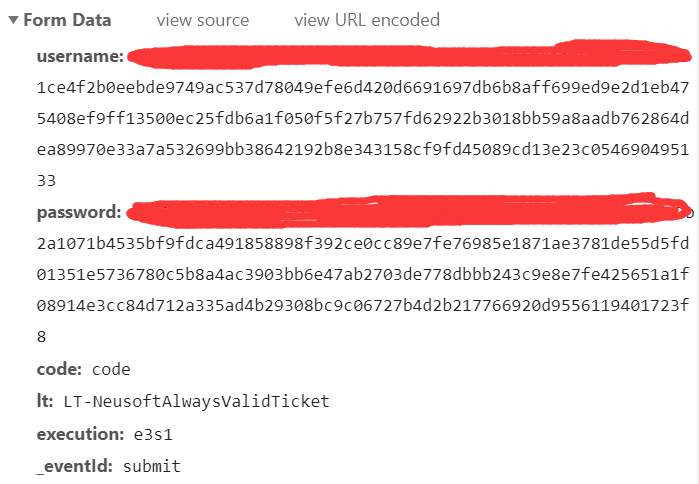

# HustPJ

[toc]

## 更新提示

👿👿👿

**学校最近更新了HUST系统的登录方式，原来的登陆方式失效了，今天按照学校最新的加密过程重写了登陆部分的代码，大家要注意更新一下啦！！！食用方式不变还和原来一样**

👿👿👿


**本次更新完成的内容**

[⌛](https://emojipedia.org/hourglass/) 更新了网站加密方式的js文件

[⌛](https://emojipedia.org/hourglass/) 更新了网站模拟登陆的方法

[⌛](https://emojipedia.org/hourglass/) 更新了README里面关于新加密方式的介绍


**本脚本可以实现一些一开始我也没想到的效果**

❤️ 可以在学校关闭评教的提交页面后继续评教~~（这个我是没想到的）~~

## 介绍

**华中科技大学一键评教脚本**

用python写的一个脚本，用于2019年秋季学期的评教。

最近在做爬虫的课设，想起来可以做一个脚本出来试试帮助自己完成评教的繁琐过程，最后应该算是做出来了，码字的过程以后慢慢写，现在介绍食用方法。

**当然。。我个人没有那么多学号，不能测试是不是真的好用，希望大家试一试找找bug（感谢借我账号测试的室友和同学xxx和xx）**

## 食用方法

1. 安装`python3`及其以上版本。

2. 安装依赖库
``` 
pip install -r requirements.txt
```

3. 克隆仓库

```
git clone https://github.com/xuzichi/HustPJ.git
```

4. 运行

找到`HustPJ`文件夹下的`hustpj.py`文件，将前面的`username`和`password`填入自己hub系统的账号密码，直接运行即可。

5. 修改对某位老师评价

现在是默认好评，如果想要针对某个老师给差评，建议大家先去给差评之后，再来用这个，如果是大佬，欢迎修改本程序！

## 额外说明！！

如果出现了和`execjs`有关的报错，去安装下载最新版的`node.js`应该就可以解决

如果你的课程超过了27门，可以手动在代码的`for`循环里面改一下`page`参数~~（懒得设置页面没有课程时自动停止了，就干脆直接循环三页。。。）~~

有疑问的可以联系`QQ：2417094688`

## 码字的过程

这里参考了[cycychenyi](https://github.com/cycychenyi/PingJiao)的武汉大学评教的一些思路，表示感谢！

一键评教应该是个很简单的东西，但一直没有找到相关的~~（黑脸，没有看到那个用selenium来写的）~~，索性就自己开写，下面就给大家聊一下这个基本思路。

### 1、登录（旧版本登陆系统）

无论如何，我们先上评教网站瞅一瞅。[华中科技大学课程中心](http://curriculum.hust.edu.cn/)


很显然，接下来就是点击登录按钮，输入账号密码，再进入我们熟悉的评教网站了，那我们这部分要解决的就是模拟登录的问题。

进入网站，打开F12，进入network标签页， 勾选 Preserve log，这样在页面刷新的时候请求记录还会保留，不会被刷新掉 。

我们先试着去登录一下：


我们可以看到在登录过程中出现了 这些请求，我们可以先排除用于网页加载的`png`、`css`和`js`文件，那么我们需要关注的请求大概就那么几个，可以看到在第一个`login?...`的POST请求中，headers部分包含了我们想要看到的内容：



这里面可以看到是加密过的学号和密码，还有一个隐藏的数据，我们接下来就是去寻找加密方法和这些隐藏的数据。

简单在网页源代码中直接查找`username`，可以看到：


我们直接找到了所有上传数据在网页中的部分，我们就可以先写好这部分：

```python
username = ''# 填入自己的学号
password = ''# 填入自己的密码
login = 'https://pass.hust.edu.cn/cas/login?service=http%3A%2F%2Fcurriculum.hust.edu.cn%2Fhustpass.do'

# 使用会话保持 cookie
s = requests.Session()

# 首次请求，获取隐藏参数
start_response = s.get(login)
start_html = etree.HTML(start_response.text, parser=etree.HTMLParser())
lt = start_html.xpath('//*[@id="fm1"]/input[6]/@value')[0]
execution = start_html.xpath('//*[@id="fm1"]/input[7]/@value')[0]
_eventId = start_html.xpath('//*[@id="fm1"]/input[8]/@value')[0]

# 登录
data = {
    'username': username,
    'password': password,
    'lt': lt,
    'execution': execution,
    '_eventId': _eventId,
}
login_response = s.post(login, data=data)  # 重定向请求必须加上 allow_redirects=False
```

当然，我们直接运行是不能登录的，因为`username`和`password`部分并不是明文传输的，网站对其进行加密，不过学校的网站也不太会进行太难的加密过程，我们试着去找一下网站是如何加密的。

继续在网页源代码里面搜索`username`可以找到这么一段`js`代码：

```javascript
		bodyRSA();
		var userresult = encryptedString(key, _username);
		$("#username").val(userresult);
		var pwdresult = encryptedString(key, _password);
		$("#password").val(pwdresult);
		
	function bodyRSA(){
		setMaxDigits(130);
		key = new RSAKeyPair("10001","","89b7ad1090fe776044d393a097e52f99fc3f97690c90215ecb01f1b3dfc4d8b0226a4b16f51a884e0c1545180eb40365dbec848cc0df52f515512e2317bf9d82b6f4c9cafcc94082fd86c97e77a4d3aa44cba54f8d94f5757ce3cc82c3adf31082738cfe531b4b4675f35a0c8401745dbed15c92d0747c6349915378fff22b9b"); 
	}
```

那么加密的过程就有了，先调用`bodyRSA()`函数创建`key`变量，然后将`key`分别和`username`、`password`分别传入`encryptedString()`函数中进行加密，并提交加密后的`username`和`password`。

接下来去寻找`RSAKeyPair()`和`encryptedString()`两个函数，直接全局搜索，我们便顺藤摸瓜找到了三个相关的`js`文件：`RSA.js`、`BigInt.js`和`Barrett.js`，因为`Python`可以直接调用`js`文件，那么我们也不用分析整个加密过程究竟是怎么来的了，我们只需要将`username`和`password`扔到里面加密获取结果就好了。

这样，我们用于模拟登录的参数都已经获得了，下一步就是发送请求了。

模拟登录部分的代码：

```Python
username = ''# 填入自己的学号
password = ''# 填入自己的密码
login = 'https://pass.hust.edu.cn/cas/login?service=http%3A%2F%2Fcurriculum.hust.edu.cn%2Fhustpass.do'

# 使用会话保持 cookie
s = requests.Session()

# 首次请求，获取隐藏参数
start_response = s.get(login)
start_html = etree.HTML(start_response.text, parser=etree.HTMLParser())
lt = start_html.xpath('//*[@id="fm1"]/input[6]/@value')[0]
execution = start_html.xpath('//*[@id="fm1"]/input[7]/@value')[0]
_eventId = start_html.xpath('//*[@id="fm1"]/input[8]/@value')[0]

with open('login.js', 'r') as f:
    js_login = f.read()

ctx = execjs.compile(js_login)
username_result = ctx.call('encryptedString', username)
password_result = ctx.call('encryptedString', password)

# 登录
data = {
    'username': username_result,
    'password': password_result,
    'lt': lt,
    'execution': execution,
    '_eventId': _eventId,
}
login_response = s.post(login, data=data)  # 重定向请求必须加上 allow_redirects=False
print(login_response.text)
```

可以看到结果，我们已经成功登录了。

### 1、登陆（新版本登陆系统）

在2020年1月10多号的时候，学校的登录系统有了更新，随之而来的就是新的加密方式~~（当然和以前都差不多的思路）~~，我们需要重写登陆部分的代码。

这次登陆我们依然是先登录观察、抓包分析。

登录之后，我们可以看到：


这次的请求主要有以下参数：

`rsa`：应该是把学号和密码放在一起进行某种加密后的数据

`ul`：经过后面的分析可知，这是学号的长度

`pl`：经过后面的分析可知，这是密码的长度

`lt`：同老系统

`execution`：同老系统

`_eventld_`：同老系统

那么我们关键是需要找到加密过程的js代码和相关参数：

js文件并不多，我们查找与`username`、`password`、`ul`、`pl`、`rsa`有关的部分

经过查找后，我们可以看到在：


`login_standar.js`和`des.js`中找到了相关的加密过程;


分析可以得到`ul`和`pl`参数的意义，同时可以发现`rsa`经过`strEnc`可以得到加密后的结果，那么我们只需要仿照这个过程完成即可。

代码略

### 2、获取需要评价的课程列表

我们先进入[网上评教](http://curriculum.hust.edu.cn/kc/wspj.jsp?xnxq=20191&nownum=1&befnum=1&scnum=1&oldxnxq=20182)的网站，可以看到列表里面（保护隐私，我就不上图了），每一页共有九个课程，课程下面的评教一般有几种状态：`不参与评价`、`查看评价`、`未评价`、`未评完`，我们仍旧是通过`F12`打开`Network`标签页去找我们需要的东西。

可以发现


我们请求返回的网页中并没有我们需要的课程信息，那么我们可以猜测这个网站也是属于动态刷新那一类的，分析XHR的请求，发现了两个有价值的请求：


这两个请求返回了我们想要的课程信息（图略）。

那么我们试着添加`form data`模拟发送POST请求，查看他们的返回结果：

```python
username = ''  # 在这里输入自己的学号
password = ''  # 在这里输入自己的密码
xnxq = '20191'
pjlc = '2019101'
data_1 = {
    'hidOption': 'getWspjPjlc',
    'page': page,
    'xnxq': 'null',
    'userid': username
}
data_2 = {
    'hidOption': 'getWspjToKC',
    'userid': username,
    'page': page,
    'xnxq': xnxq,
    'pjlc': pjlc,
}
response = s.post(url, data=data_1)
response = s.post(url, data=data_2)
print(response.text)
```

经过尝试，我们可以得到这几个参数的特征：

`hidOption`：固定参数

`page`：对应的是评教页面的页数

`xnxq`：第一次请求固定为`null`，第二次请求为和学期有关的数据

`pjlc`：和学期有关的数据

在模拟登录之后发送设定好的POST请求，我们可以得到包含课程信息的数据，通过`page`的改变可以实现获取下一页课程信息的功能。

再之后就是通过xpath和正则表达式获取我们需要的课程信息：

`kcdm`：课程代码

`size`：老师个数

部分代码：

```python
result = html_page.xpath('//div[contains(@style, "cursor:pointer;")]/@onclick')
kcdm = []
for result_i in result:
    if re.match('^gotoKcpj\(\'\',\'(\w*)', result_i) is None:
        if re.match('^gotoWspj\(\'\',\'(\w*)', result_i) is None:
            pass
        else:
            kcdm.append(re.match('^gotoWspj\(\'\',\'(\w*)', result_i).group(1))
    else:
        kcdm.append(re.match('^gotoKcpj\(\'\',\'(\w*)', result_i).group(1))
html_page = html.fromstring(response.text)
size = html_page.xpath('//input[@name="size"]/@value')
```

### 3、开始评教

这一部分就简单的多了，首先就是根据课程列表访问课程评教的界面，获取老师的`jsid`（根据后面提交的POST内容获得的），然后直接发送POST请求即可完成评教。

我们还是先进入某课程的评教界面，评教完成后直接提交，可以在`Network`里面可以看到一个POST请求（现在没图了。。）

POST的目标网站：

```
http://curriculum.hust.edu.cn/cc_HustWspjTeacherAction.do?hidOption=SAVE
```

它包含了一下信息：

```
hidOption: ADD
hidKey:
commit: 0001,95,01@0002,95,01@0003,95,01@0004,95,01@0005,95,01@0006,95,01@
id:
size: 1
num: 0
zbmb: 008
pjlx: 01
xnxq: 20191
jsid: E199700295
kcdm: w120094
pjlc: 2019101
userid: U2017*****
grade0: 95
grade1: 95
grade2: 95
grade3: 95
grade4: 95
grade5: 95
yjjy:
yp_flag: 0
```

那么我们可以得到参数的含义：

`hidOption`：一如既往的固定参数

`hidKey`：不清楚含义，但一直为空

`commit`：包含了我们在每一项中给老师评的等级

`id`：不清楚含义，但一直为空

`size`：课程包含老师的个数

`num`：课程下的第几位老师

`zbmb`：不清楚含义，但自己自己提交的时候一直为`008`

`pjlx`：不清楚含义，应该和目录相关，默认即可

`xnxq`：和学期有关

`jsid`：应该是老师的代码，可能和老师的任职时间有关

`kcdm`：直接就是课程代码

`pjlc`：和学期有关

`userid`：学号

`grade(x)`：每一项给老师的得分

`yjjy`：不清楚含义，但是一直为空

`yp_flag`：不清楚含义，但一直为`0`

了解这些之后就好解决问题了，我们只需要获取必要的参数与固定的参数集合，发送POST请求即可完成评教


最终的代码，大家直接看文件夹中的就行了，没写太多注释